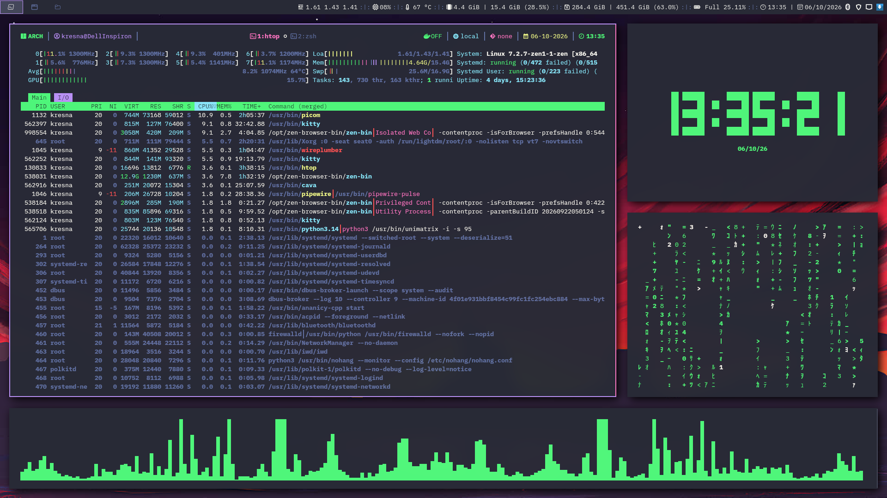

# I3 Window Manager

[](https://github.com/laksana-kresna-dev/i3/actions/workflows/ci.yml)
[](https://github.com/laksana-kresna-dev/i3/actions/workflows/release.yml)
[](https://github.com/laksana-kresna-dev/i3/releases)
[](LICENSE)

> My personal i3 window manager rice, running on Arch Linux.



## Overview

A tiling desktop setup built around [i3](https://i3wm.org/) — minimal,
keyboard-driven, and configured entirely from a plain text file. This
repository also doubles as a quick way to restore my setup on a fresh
Arch install.

## Architecture & Tech Stack

| Domain                   | Technology / Tool               |
| :----------------------- | :------------------------------ |
| **Window Manager**       | i3-wm                           |
| **Compositor**           | Picom (GLX Backend, Animations) |
| **Status Bar**           | Polybar                         |
| **Notification Daemon**  | Dunst                           |
| **Application Launcher** | Rofi / dmenu                    |

## Component Highlights

- **i3 Window Manager:** Minimalist tiling desktop setup configured with intuitive `$mod`-key navigation, automated workspace assignments, dynamic splitting, and zero window decoration bloat.
- **Picom Compositor:** Hardware-accelerated GLX backend providing screen-tearing elimination, subtle window fade effects, rounded corners, and customizable opacity rules.
- **Polybar Status Bar:** Modern, modular status bar showcasing real-time system metrics (CPU, memory, storage, network interface status), active workspace indicators, and system tray integration.
- **Dunst Notification Daemon:** Lightweight notification system customized with urgency-based color schemes, tailored display timeouts, and hotkey controls for dismissing and reviewing notification history.
- **Rofi & dmenu Launchers:** Dual-purpose workflow execution—Rofi as an interactive launcher and window switcher, with `dmenu` serving as a lightweight fallback for quick command execution.

## Quick Start & Installation

1. Backup Existing Configuration:

   ```sh
   [ -d ~/.config/i3 ] && mv ~/.config/i3 ~/.config/i3.bak-$(date +%Y%m%d%H%M%S)
   ```

2. Clone this repository directly into `~/.config/i3`:

   ```sh
   git clone [https://github.com/laksana-kresna-dev/i3.git](https://github.com/laksana-kresna-dev/i3.git) ~/.config/i3
   ```

3. Restart i3 in-place via $mod+Shift+r or terminal:

   ```sh
   i3-msg restart
   ```

## Keybindings

The modifier key (`$mod`) is set to the **Windows/Super key** (`Mod4`).

| Keybinding           | Action                                   |
| -------------------- | ---------------------------------------- |
| `$mod+Return`        | Open a terminal                          |
| `$mod+Shift+q`       | Kill focused window                      |
| `$mod+d`             | Open dmenu launcher                      |
| `$mod+j/k/l/;`       | Move focus left/down/up/right            |
| `$mod+Shift+j/k/l/;` | Move focused window                      |
| `$mod+h` / `$mod+v`  | Split horizontal / vertical              |
| `$mod+f`             | Toggle fullscreen                        |
| `$mod+s/w/e`         | Layout: stacking / tabbed / toggle split |
| `$mod+Shift+space`   | Toggle floating                          |
| `$mod+1`–`$mod+0`    | Switch workspace                         |
| `$mod+Shift+1`–`0`   | Move window to workspace                 |
| `$mod+r`             | Enter resize mode                        |
| `$mod+Shift+r`       | Restart i3                               |
| `$mod+Shift+e`       | Exit i3                                  |

Full reference: [i3 User's Guide](https://i3wm.org/docs/userguide.html)

## Contributing

Contributions are welcome! Please adhere to the following guidelines:

- **Issue Reporting:** Submit bug reports or feature requests using the structured **[Issue Forms](.github/ISSUE_TEMPLATE/)**.
- **Pull Requests:** Ensure all PRs follow the guidelines and verification checklists in the **[PR Template](.github/PULL_REQUEST_TEMPLATE.md)**.
- **Commit Standards:** Follow [Conventional Commits](https://www.conventionalcommits.org/) (`feat:`, `fix:`, `chore:`, `docs:`) to enable automated semantic releases and changelog updates.

## License

Distributed under the [MIT License](./LICENSE). See `LICENSE` for more information.
